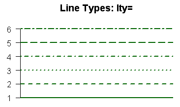
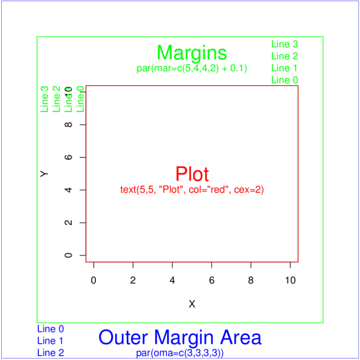

Outline: what you expect to learn
===
- plot basics
    - scattered plot
    - margins
    - histogram and heatmap
- ggplot2
- lattice


Plotting in R
===
R is powerful to visualize your data.

- plot(): a generic plotting function
    - points(): add points to the plot.
    - lines(), abline(): add lines
    - text(): add text 
    - legend(): add legend
- hist(): histogram
- image(), heatmap(): heatmaps
- boxplot(): boxplot
- curve(): any function curve
- contour(): contour plot


scattered plot
===
```{r}
n <- 80
set.seed(32611)
x <- sort(runif(n, min = 0, max=2*pi))
y <- sin(x) + rnorm(n, mean = 0, sd = 0.2)
plot(x,y)
```


Type
===

- "p": for points
- "l": for lines
- "b" for both,
- "o" for both ‘overplotted’,
- "n" for no plotting.

---

```{r}
plot(x,y, type="p") ## default is "p"
```

---

```{r}
plot(x,y, type="l")
```

---

```{r}
plot(x,y, type="b")
```

---

```{r}
plot(x,y, type="o")
```

---

```{r}
plot(x,y, type="n")
```


Labels
===

- main: title
- xlab: x labels
- ylab: y labels

```{r}
plot(x,y, main="sin function with Gaussian noise") # default xlab and ylab are the variable names of the arguments
```


---

```{r}
plot(x,y, main="sin function with Gaussian noise", 
     xlab="x axis", ylab="y axis") 
```


Text and Symbol Size
===
- cex: number indicating the amount by which plotting text and symbols should be scaled relative to the default. 1=default, 1.5 is 50% larger, 0.5 is 50% smaller, etc.
- cex.axis	magnification of axis annotation relative to cex
- cex.lab	magnification of x and y labels relative to cex
- cex.main	magnification of titles relative to cex
- cex.sub	magnification of subtitles relative to cex

--- 
```{r}
plot(x,y, main="sin function with Gaussian noise", 
     xlab="x axis", ylab="y axis", 
     cex=2, cex.axis=2, cex.lab=2, cex.main=2, cex.sub=2) 
```


Point type
===
- pch is an argument for point typs
```{r}
plot(1:25,1:25,pch=1:25)
```

---

- use pch = 19
```{r}
plot(x,y, pch=19) 
```


Multiple plots
===
- Use par() with mfcol or mfrow settings to create a nxm grid of figures.
    - mfcol=c(nr, nc) adds figures by column
    - mfrow=c(nr, nc) adds figures by row

---

```{r}
n <- 80
set.seed(32611)
x <- sort(runif(n, min = 0, max=2*pi))
y1 <- sin(x) + rnorm(n, mean = 0, sd = 0.2)
y2 <- cos(x) + rnorm(n, mean = 0, sd = 0.2)

par(mfrow=c(1,2))
plot(x,y1, main="sin plot")
plot(x,y2, main="cos plot")
```

Lines
===
- lty:	line type. see the chart below.



- lwd	line width relative to the default (default=1). 2 is twice as wide.


---

```{r}
par(mfrow=c(2,2))
plot(x,y, type="l",lwd=1) 
plot(x,y, type="l",lwd=2) 
plot(x,y, type="l",lwd=3) 
plot(x,y, type="l",lwd=4) 
```


color
===
- col argument to control the color
- col = 1:8 for eight basic colors
- a string for 657 available colors (check out colors() )
- RGB: "#rrggbb". 
    - rr: red intensity, 00-FF (Hexadecimal)
    - gg: green intensity, 00-FF (Hexadecimal)
    - bb: blue intensity, 00-FF (Hexadecimal)
    - e.g. #FF0000 represent red color.
    
---
```{r}
plot(1:8,1:8, col=1:8) 
```


---

```{r}
par(mfrow=c(2,2))
plot(x,y, main = "black color") ## default is black
plot(x,y, main = "blue color", col=4) ## basic color option 1:8
plot(x,y, main = "green color", col='green') ## find colors from colors()
plot(x,y, main = "red color", col='#FF0000') ## RGB mode
```

More on colors
===
- More on color argument for plot
    - col	Default plotting color. Some functions (e.g. lines) accept a vector of values that are recycled.
    - col.axis	color for axis annotation
    - col.lab	color for x and y labels
    - col.main	color for titles
    - col.sub	color for subtitles
    - fg	plot foreground color (axes, boxes - also sets col= to same)
    - bg	plot background color
- You can also create a vector of n contiguous colors using the functions rainbow(n), heat.colors(n), terrain.colors(n), topo.colors(n), and cm.colors(n).


text
===

- After create a plot, you can add text to it by text.

```{r}
letters[1:10] ## letters contain a-z
plot(x=1:10, y=1:10, type="n", main = "some text") 
text(x = 1:10, y=1:10, labels = letters[1:10])
```


curve
===

- curve() allow you plot any function
```{r}
curve(sin, from = 0, to = 2*pi)
```

---

```{r}
chippy <- function(x) sin(cos(x)*exp(-x/2))
curve(chippy, -8, 7, n = 2001) # n specify number of points used to draw the curve, default n = 101
```

legend
===

- ?legend for more options
 
```{r}
curve(sin, 0, 2*pi, col=2)
curve(cos, 0, 2*pi, col=4, add=T) ## add=T to overlay a new curve on top of the original figure
legend("bottomleft", legend = c("sin", "cos"), col = c(2,4),lty = 1)
```


margin
===


---

- to change margins, use the par() function, with the argument mar. 
```{r}
par(mar=c(1,2,3,4)) # bottem, left, top, right order, inner margin
plot(x, y, main="Red sin", pch=20, col="red")
```

---

```{r}
par(oma = c(4,3,2,1), mar=c(1,2,3,4)) # bottem, left, top, right order, inner margin and outer margin
plot(x, y, main="Red sin", pch=20, col="red")
```

save plot
===
- Figures can be saved as .pdf, .png, .jpeg, .bmp, .tiff by using pdf(), png(), jpeg(), bmp(), tiff().
- PDF format is recommended since it is vector format. resize the figure woun't affect the quality.

```{r}
pdf("sinFunction.pdf")
n <- 80
set.seed(32611)
x <- sort(runif(n, min = 0, max=2*pi))
y <- sin(x) + rnorm(n, mean = 0, sd = 0.2)
plot(x,y)
dev.off()
```


IRIS data example
===
```{r}
data(iris)
head(iris)
str(iris)
```

boxplot
===
```{r}
boxplot(Petal.Length ~ Species, data = iris)
```

---

```{r}
names(iris)
par(mfrow = c(2,2))
for(i in 1:4){
  aname <- names(iris)[i]
  boxplot(iris[[i]] ~ iris$Species, xlab="Species", col=i, ylab=aname, main=aname)  
}
```


histogram
===
```{r}
hist(iris$Petal.Length)
```

```{r}
density.est = density(iris$Petal.Length)
hist(iris$Petal.Length, freq=FALSE, breaks=seq(0,7,0.5),
     xlab="petal length", main="petal length distribution")
lines(density.est, lwd=3)
```

---

```{r}
par(mfrow = c(2,2))
xlims <- range(iris$Petal.Length)
uniqueSpecies <- levels(iris$Species)
for(i in 1:3){
  aspecies <- uniqueSpecies[i]
  sampleSelection <- iris$Species==aspecies
  adata <- iris$Petal.Length[sampleSelection]
  hist(adata, col=i, xlim=xlims, xlab="petal length",main=aspecies)
}

```


heatmap
===
- image
- heatmap
- lattice package

```{r}
matrix <- as.matrix(iris[,1:4])
image(matrix)
```

---

```{r}
heatmap(matrix)
```

---

```{r}
library(lattice)
levelplot(matrix)
```


ggplot2
===


lattice plot
===

- [http://www.isid.ac.in/~deepayan/R-tutorials/labs/04_lattice_lab.pdf](http://www.isid.ac.in/~deepayan/R-tutorials/labs/04_lattice_lab.pdf)

- [http://www.statmethods.net/advgraphs/trellis.html](http://www.statmethods.net/advgraphs/trellis.html)