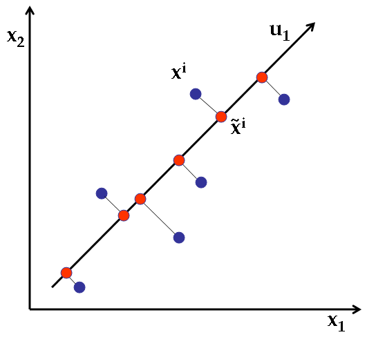

Outlines
===
- Principal component analysis
- Singular value decomposition

Principal component analysis
===

- Can effectively perform dimension reduction
- A toy example of projecting 2-dimensional data onto 1 dimensional.


Another motivating example
===

- Usually use first principle component and second principle component direction to visualize the data
- Motivating example: iris data, 150 observations, 4 variables (features)
```{r}
head(iris)
dim(iris)
```

---

- Perform PCA
    - project these 4 features onto 2 dimensional space 
- visualize the data.
```{r}
iris.data <- iris[,1:4]
ir.pca <- prcomp(iris.data,
                 center = TRUE,
                 scale. = TRUE) 
PC1 <- ir.pca$x[,"PC1"]
PC2 <- ir.pca$x[,"PC2"]
plot(PC1, PC2, col=as.numeric(iris$Species),pch=19)
legend("topright", legend = levels(iris$Species), col =  unique(iris$Species), pch = 19)
```

How to determine the principal directions?
===
- by find the direction such that the projected data have the largest variance.
```{r}
biplot(ir.pca)
```