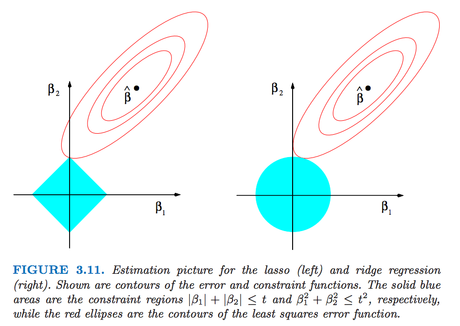

Outlines
===
- Ridge regression
- Lasso
- Elastic net

linear regression model
===
$$Y = \beta_0 + \beta_1X_1 + \beta_2X_2 + \ldots + \beta_pX_p + \varepsilon, \text{with }\varepsilon \sim N(0, \sigma^2)$$

- Y: outcome variable or response.
- $X_1, X_2, \ldots, X_p$ are called predictors.
- $\beta_0, \beta_1, \ldots, \beta_p$ are called coefficient, for which we will estimate.


Prostate cancer data
===
The data is from the book element of statistical learning

```{r}
library(ElemStatLearn)
str(prostate)
prostate$train <- NULL
```


Regularized linear model
===
- ridge regression.
- lasso.


ridge regression.
===
- Recap for linear model:
    - The least square estimator is uniformly minimum-variance unbiased estimator (UMVUE).
    - However, people cares about mean squared error (MSE) instead of purely unbiasness.
    - Linear regression has low bias (zero bias) but suffers from high variance. (Sometimes suffers collinearity issue.)
- Ridge regression:
    - sacrifice unbiasness a little bit but recude MSE.
    
$$\hat{\beta}^{ridge} = \arg\min_{\beta\in\mathbb{R}^p}
\sum_{i=1}^n(y_i - x_i^\top \beta)^2 + \lambda\sum_{j=1}^p \beta_j^2$$

- $\lambda \ge 0$ is a tuning parameter, controling the strength of the penalty term.
    - $\lambda =0$, we have original linear regression.
    - $\lambda = \infty$, we get $\hat{\beta}^{ridge} = 0$
    - For $\lambda$, we both fit a linear model and shrink the coefficients.

ridge regression example
===

```{r}
library(MASS)
lm_ridge <- lm.ridge(lpsa ~ ., data=prostate, lambda=0); lm_ridge
lm(lpsa ~ ., data=prostate)
```

ridge regression example 2
===

```{r}
lm.ridge(lpsa ~ ., data=prostate, lambda=1)
lm.ridge(lpsa ~ ., data=prostate, lambda=Inf)
```

lasso
===
- Problem with ridge regression: coefficient won't be shrinked to exact 0.
- Lasso, the $l_1$ norm penalty will shrink come of the coefficients to exact zero.
$$\hat{\beta}^{lasso} = \arg\min_{\beta \in \mathbb{R}^P} \|y - X\beta\|_2^2 + \lambda \sum_{j=1}^p |\beta_j|$$
- $\|\beta\|_1 = \sum_{j=1}^p |\beta_j|$ is called $l_1$ norm.
- $\lambda \ge 0$ is a tuning parameter, controling the strength of the penalty term.
    - $\lambda =0$, we have original linear regression.
    - $\lambda = \infty$, we get $\hat{\beta}^{ridge} = 0$
    - For $\lambda$, we both fit a linear model and shrink some coefficients to **exact zero**.

lasso example
===
- lasso was implemented in R lars package.
```{r}
library(lars)
x <- as.matrix(prostate[,1:8])
y <- prostate[,9]
lassoFit <- lars(x, y) ## lar for least angle regression
coef(lassoFit, s=2, mode="lambda") ## get beta estimate when lambda = 2
```
visualize lasso path
===
- lasso solution (beta estimate is piecewise linear with respect to lambda)
```{r}
plot(lassoFit)
```


Intuition for lasso and ridge regression
===
- lasso regression equivalent forms.
    - in penalty form:
$$\hat{\beta}^{lasso} = \arg\min_{\beta \in \mathbb{R}^P} \|y - X\beta\|_2^2 + \lambda \sum_{j=1}^p |\beta_j|$$
    - in constraint form:
$$\hat{\beta}^{lasso} = \arg\min_{\beta \in \mathbb{R}^P} \|y - X\beta\|_2^2, s.t  \sum_{j=1}^p |\beta_j| \le \mu$$ 


- ridge regression equivalent forms.
    - in penalty form:
$$\hat{\beta}^{ridge} = \arg\min_{\beta\in\mathbb{R}^p}
\sum_{i=1}^n(y_i - x_i^\top \beta)^2 + \lambda\sum_{j=1}^p \beta_j^2$$
    - in constraint form:
$$\hat{\beta}^{ridge} = \arg\min_{\beta\in\mathbb{R}^p}
\sum_{i=1}^n(y_i - x_i^\top \beta)^2, s.t  \sum_{j=1}^p \beta_j^2 \le \mu$$

Intuition for lasso and ridge regression
===
- Lasso: $\hat{\beta}^{lasso} = \arg\min_{\beta \in \mathbb{R}^P} \|y - X\beta\|_2^2, s.t  \sum_{j=1}^p |\beta_j| \le \mu$
- Ridge: $\hat{\beta}^{ridge} = \arg\min_{\beta\in\mathbb{R}^p}
\sum_{i=1}^n(y_i - x_i^\top \beta)^2, s.t  \sum_{j=1}^p \beta_j^2 \le \mu$



How to choose Tuning parameter
===
- cross validation, leave this for future lecture.


Elastic net
===

Random effect model
===
