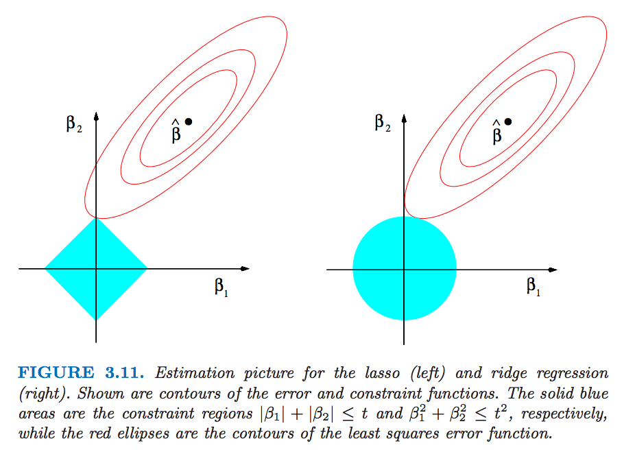

Outlines
===
- Linear regression


linear regression model
===
$$Y = \beta_0 + \beta_1X_1 + \beta_2X_2 + \ldots + \beta_pX_p + \varepsilon, \text{with }\varepsilon \sim N(0, \sigma^2)$$

- Y: outcome variable or response.
- $X_1, X_2, \ldots, X_p$ are called predictors.
- $\beta_0, \beta_1, \ldots, \beta_p$ are called coefficient, for which we will estimate.


Prostate cancer data
===
The data is from the book element of statistical learning

```{r}
library(ElemStatLearn)
str(prostate)
prostate$train <- NULL
```

---

Explanation of these variables:

- lpsa: log PSA score
- lcavol: log cancer volume
- lweight: log prostate weight
- age: age
- lbph: log of the amount of benign prostatic hyperplasia
- svi: seminal vesicle invasion
- lcp: log of capsular penetration
- gleason: Cleason score
- pgg45: percent of Gleason scores 4 or 5.
- train: a logical vector indicating training data or testing data (ignore at this moment)

---

```{r}
head(prostate)
```

Exploratory analysis
===
- Distribution of each varaible.
- correlation between each pair of vairables.
- visualizing the scattered plot of each pair of variables.


Distribution of each varaible -- Histogram
===
```{r}
par(mfrow=c(3,3))
for(i in 1:9){
  aname <- names(prostate)[i]
  hist(prostate[[i]], main=aname)
}
```

---

What can we learn from the histogram.

Correlation between each pairs of variables 
===
```{r}
cor_prostate <- cor(prostate)
max(cor_prostate[cor_prostate!=1])
maxID <- arrayInd(which(max(cor_prostate[cor_prostate!=1]) == cor_prostate), dim(cor_prostate))
names(prostate[maxID[1,]])
```

visualizing the scattered plot of each pair of variables.
===
```{r}
pairs(prostate,pch=19)
```


Fit linear regression model
===
- lm(formula, data): to fit a linear regression model. 
    - formula: Symbolic description of the model (E.g Y ~ X1 + X2 + ... + Xp)
        - Y is the response variable.
        - X's are the predictors.
    - data: dataframe containing the variables in the model

```{r}
lm_prostate <- lm(lpsa ~ age + lweight, data = prostate)
lm_prostate
class(lm_prostate)
names(lm_prostate)
```

lm() utility functions
===
- coef(): get coefficient
```{r}
coef(lm_prostate)
```
- fitted(): get fitted value, where fitted values are defined as
$\hat{\beta_1}X_1 + \hat{\beta_2}X_2 + \ldots + \hat{\beta_p}X_p$
```{r}
plot(fitted(lm_prostate), prostate$lpsa, pch=19)
abline(a=0, b=1, lty=2, col="red")
```


---

- summary(): provide a summary of linear model fitting
```{r}
summary(lm_prostate)
```


---

- plot(): visualize linear model fitting
```{r}
plot(lm_prostate)
```

---

- predict(): predict a new subject.
    - If there is a new subject coming in with age 65 and lweight 4, what will be his predicted lpsa based our fitted linear model?
```{r}
anew <- data.frame(age = 65, lweight=4)
predict(object = lm_prostate, anew)
```


---

- summary(): get a nice summary of linear model.
```{r}
summary(lm_prostate)
```

Other formulas
===
- Basic form of a formula:
    - response ~ model
- Formula notation:
    - +: Soparates main effects
    - : Denote interactions
    * : main effects and interactions
    ^n : include all main effects and n-order interactions
    - : remove the specified terms
    I() : Brackets the portions of a formula where operators are used mathematically
    . : Main effect for each column in the dataframe, except the response.
    

Fit a linear regression with interaction term
===
```{r}
lm_interaction <- lm(lpsa ~ lcavol + svi + lcavol:svi, data=prostate) ## : represent interaction term.
summary(lm_interaction)
lm_interaction2 <- lm(lpsa ~ lcavol * svi, data=prostate) ## * represent main effect and interaction
```


Fit a linear regression model with all variables
===
```{r}
lm_all <- lm(lpsa ~ ., data=prostate) ## . Rest of all the other vaiables.
summary(lm_all)
```


Model selection
===

- AIC, BIC
- forward selection and backward selection

AIC, BIC
===
- AIC: Akaike information criterion
- $AIC = 2k - 2 \log ( {\hat{L}} )$
    - k: number of parameters.
    - $\hat{L}$: likelihood given the coefficient estimates
```{r}
AIC(lm_all)
```

- BIC: Bayesian information criterion
- $BIC = log(n)k - 2 \log ( {\hat{L}} )$
```{r}
BIC(lm_all)
```

backward selection
===
- step() function can perform forward selection, backward selection or both.

```{r}
step(lm(lpsa ~ ., data=prostate)) ## default is backward selection
```

--- 
- You may notice that AIC from step() and AIC() are different
- AIC/BIC can be different for different methods up to a constant.
```{r}
stepDetails <- step(lm(lpsa ~ ., data=prostate), trace=0)$anova
stepDetails$AIC[2] - stepDetails$AIC[1]

AIC(lm(lpsa ~ . - gleason, data=prostate)) - AIC(lm(lpsa ~ ., data=prostate))

```
Regularized linear model
===
- ridge regression.
- lasso.


ridge regression.
===
- Recap for linear model:
    - The least square estimator is uniformly minimum-variance unbiased estimator (UMVUE).
    - However, people cares about mean squared error (MSE) instead of purely unbiasness.
    - Linear regression has low bias (zero bias) but suffers from high variance. (Sometimes suffers collinearity issue.)
- Ridge regression:
    - sacrifice unbiasness a little bit but recude MSE.
    
$$\hat{\beta}^{ridge} = \arg\min_{\beta\in\mathbb{R}^p}
\sum_{i=1}^n(y_i - x_i^\top \beta)^2 + \lambda\sum_{j=1}^p \beta_j^2$$

- $\lambda \ge 0$ is a tuning parameter, controling the strength of the penalty term.
    - $\lambda =0$, we have original linear regression.
    - $\lambda = \infty$, we get $\hat{\beta}^{ridge} = 0$
    - For $\lambda$, we both fit a linear model and shrink the coefficients.

ridge regression example
===

```{r}
library(MASS)
lm_ridge <- lm.ridge(lpsa ~ ., data=prostate, lambda=0); lm_ridge
lm(lpsa ~ ., data=prostate)
```

ridge regression example 2
===

```{r}
lm.ridge(lpsa ~ ., data=prostate, lambda=1)
lm.ridge(lpsa ~ ., data=prostate, lambda=Inf)
```

lasso
===
- Problem with ridge regression: coefficient won't be shrinked to exact 0.
- Lasso, the $l_1$ norm penalty will shrink come of the coefficients to exact zero.
$$\hat{\beta}^{lasso} = \arg\min_{\beta \in \mathbb{R}^P} \|y - X\beta\|_2^2 + \lambda \sum_{j=1}^p |\beta_j|$$
- $\|\beta\|_1 = \sum_{j=1}^p |\beta_j|$ is called $l_1$ norm.
- $\lambda \ge 0$ is a tuning parameter, controling the strength of the penalty term.
    - $\lambda =0$, we have original linear regression.
    - $\lambda = \infty$, we get $\hat{\beta}^{ridge} = 0$
    - For $\lambda$, we both fit a linear model and shrink some coefficients to **exact zero**.

lasso example
===
- lasso was implemented in R lars package.
```{r}
library(lars)
x <- as.matrix(prostate[,1:8])
y <- prostate[,9]
lassoFit <- lars(x, y) ## lar for least angle regression
coef(lassoFit, s=2, mode="lambda") ## get beta estimate when lambda = 2
```
visualize lasso path
===
- lasso solution (beta estimate is piecewise linear with respect to lambda)
```{r}
plot(lassoFit)
```


Intuition for lasso and ridge regression
===
- lasso regression equivalent forms.
    - in penalty form:
$$\hat{\beta}^{lasso} = \arg\min_{\beta \in \mathbb{R}^P} \|y - X\beta\|_2^2 + \lambda \sum_{j=1}^p |\beta_j|$$
    - in constraint form:
$$\hat{\beta}^{lasso} = \arg\min_{\beta \in \mathbb{R}^P} \|y - X\beta\|_2^2, s.t  \sum_{j=1}^p |\beta_j| \le \mu$$ 


- ridge regression equivalent forms.
    - in penalty form:
$$\hat{\beta}^{ridge} = \arg\min_{\beta\in\mathbb{R}^p}
\sum_{i=1}^n(y_i - x_i^\top \beta)^2 + \lambda\sum_{j=1}^p \beta_j^2$$
    - in constraint form:
$$\hat{\beta}^{ridge} = \arg\min_{\beta\in\mathbb{R}^p}
\sum_{i=1}^n(y_i - x_i^\top \beta)^2, s.t  \sum_{j=1}^p \beta_j^2 \le \mu$$

Intuition for lasso and ridge regression
===
- Lasso: $\hat{\beta}^{lasso} = \arg\min_{\beta \in \mathbb{R}^P} \|y - X\beta\|_2^2, s.t  \sum_{j=1}^p |\beta_j| \le \mu$
- Ridge: $\hat{\beta}^{ridge} = \arg\min_{\beta\in\mathbb{R}^p}
\sum_{i=1}^n(y_i - x_i^\top \beta)^2, s.t  \sum_{j=1}^p \beta_j^2 \le \mu$



How to choose Tuning parameter
===
- cross validation, leave this for future lecture.


Elastic net
===

Random effect model
===
