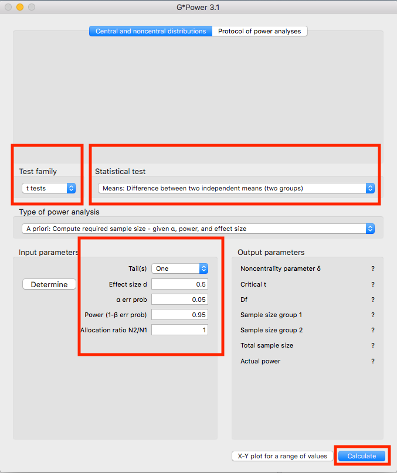
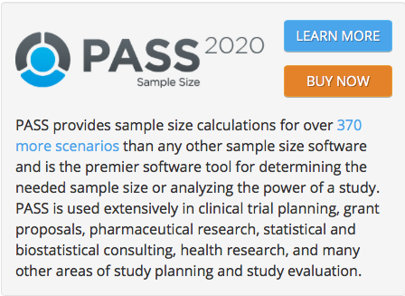

Outline
===

- Power analysis
  - Softwares
  - Theories
- Selecting appropriate statistical models


***Please interupt me at any time if you have any question.***


Power analysis
===

- Why power analysis is important?
  - You have to include sample size justification (power analysis) in your proposal.

- Have you ever included sample size justification in your proposal?
  - If so, how did you do it?


Softwares
===

1. GPOWER
2. PASS
3. (Or) Find a statistician


GPOWER
===


- GPOWER is a free software to do power calculation.
- The following statistical tests are included:
  - t-tests
  - F-tests
  - Chi-square tests
- GPOWER website
  - https://www.psychologie.hhu.de/arbeitsgruppen/allgemeine-psychologie-und-arbeitspsychologie/gpower.html


Screen shot of GPOWER
===




Demonstration of GPOWER
===

Two most commonly encountered scenarios

- Means: Difference between two independent means (two groups).
- Difference between two different proportations. 


PASS
===




- PASS is very powerful, but not free
  - Including power calculation for various scenarios
- PASS website
  - https://www.ncss.com/software/pass/
- Question:
  - Name any statistical test you can imagine?
  

Find a statistician
===

- Benefit:
  - provide consulting service
  - customize to your data or proposal
- cost:
  - some consulting fees
  - usually, this is also done through collaborations


Comparison of different approaches
===

```{r, echo = FALSE}
options(warn = -1)
library(knitr)
library(kableExtra)
suppressPackageStartupMessages(library(tidyverse))
atibble <- tibble(
  Method = c("GPOWER", "PASS", "Statistician"),
  `Basic` = c("Y", "Y", "Y"),
  `Complex` = c("", "Y", "Y"), 
  `Free` = c("Y", "", ""),
  `Customize` = c("", "", "Y")
  )
atibble %>% 
  kable() %>%
  kable_styling(c("striped", "bordered"))
```

Theories underlying Power Analysis
===

- What is power?
- What will affect power?
- Frequently asked question about power analysis.


Hypothesis testing
===

- <span style="color:orange">Null hypothesis: the treatment has no effect</span>
- <span style="color:blue">Alternative hypothesis: the treatment has an effect</span>

If we measure the effects many times in different studies,
the measured effects have a distribution around the true effect because the population are heterogeous

```{r, echo = FALSE}
x <- seq(-3,3,0.1)
d <- 3
y <- x + d
plot(1,xlim = c(-3.5, 3.5 + d), ylim = c(0, 0.4), 
     xlab = "treatment effect", ylab = "probablity", 
     type="n")
points(x = x,y = dnorm(x,0,1), type = "l", col = "orange")
points(x = y,y = dnorm(y,d,1), type = "l", col = "blue")
legend("topright", col = c("orange", "blue"), legend = c("Null", "Alternative"), lwd = 2)
```


Decision rule
===

- Decision rule: we want to set up a rule to make a decision
  - Test Positive: our decision is to reject the null hypothesis, and we declare there is an effect
  - Test Negative: our decision is not to reject the null hypothesis, and we declare there is no effect


```{r, echo = FALSE}
x <- seq(-3,3,0.1)
d <- 3
y <- x + d
plot(1,xlim = c(-3.5, 3.5 + d), ylim = c(0, 0.4), 
     xlab = "treatment effect", ylab = "probablity", 
     type="n")
points(x = x,y = dnorm(x,0,1), type = "l", col = "orange")
points(x = y,y = dnorm(y,d,1), type = "l", col = "blue")
abline(v=2, lty="dashed")
legend("topright", col = c("black"), legend = c("Decision rule"), lty="dashed", lwd = 2)
```


Decision rule, Scenario 1
===

```{r, echo = FALSE}
x <- seq(-3,3,0.1)
d <- 8
y <- x + d
plot(1,xlim = c(-3.5, 3.5 + d), ylim = c(0, 0.4), 
     xlab = "treatment effect", ylab = "probablity", 
     type="n")
points(x = x,y = dnorm(x,0,1), type = "l", col = "orange")
points(x = y,y = dnorm(y,d,1), type = "l", col = "blue")
abline(v=4, lty="dashed")
legend("topright", col = c("black"), legend = c("Decision rule"), lty="dashed", lwd = 2)
```

When the two curves are perfectly separated, 
then it is easy to make a decision.
And our decision will be correct.

```{r, echo = FALSE}
atibble <- tibble(
  Truth = c("Null", "Alternative"),
  `Test positive` = c("0", "100%"),
  `Test negative` = c("100%", "0") 
  )
atibble %>% 
  kable() %>%
  kable_styling(c("striped", "bordered"))
```


Decision rule, Scenario 2
===

```{r, echo = FALSE}
x <- seq(-3,3,0.1)
d <- 3
y <- x + d
plot(1,xlim = c(-3.5, 3.5 + d), ylim = c(0, 0.4), 
     xlab = "treatment effect", ylab = "probablity", 
     type="n")
points(x = x,y = dnorm(x,0,1), type = "l", col = "orange")
points(x = y,y = dnorm(y,d,1), type = "l", col = "blue")
abline(v=2, lty="dashed")
legend("topright", col = c("black"), legend = c("Decision rule"), lty="dashed", lwd = 2)
```

When the two curves are not separated, then it is not easy to make a decision.
In another word, no matter what decision we make, we will make some mistakes.

```{r, echo = FALSE}
atibble <- tibble(
  Truth = c("Null", "Alternative"),
  `Test positive` = c("false positive", "true positive"),
  `Test negative` = c("true negative", "false negative") 
  )
atibble %>% 
  kable() %>%
  kable_styling(c("striped", "bordered"))
```


Definition of power (1)
===

```{r, echo = FALSE}
x <- seq(-3,3,0.1)
d <- 3
y <- x + d

xvals <- seq(0,2,0.1)
yvals <- seq(2,3,0.1)

plot(1,xlim = c(-3.5, 3.5 + d), ylim = c(0, 0.4), 
     xlab = "treatment effect", ylab = "probablity", 
     type="n")
points(x = x,y = dnorm(x,0,1), type = "l", col = "orange")
points(x = y,y = dnorm(y,d,1), type = "l", col = "blue")
abline(v=2, lty="dashed")
polygon(c(xvals,rev(xvals)),
        c(dnorm(xvals,d,1), rep(0, length(xvals))),
        density = c(10), 
        angle = c(-45), 
        col = "blue")
polygon(c(yvals,rev(yvals)),
        c(dnorm(yvals,0,1), rep(0, length(yvals))),
        density = c(10), 
        angle = c(45), 
        col = "orange")
arrows(2.3,0.01,3,.05,code=1,angle=30,length=.1,lwd=2)
arrows(1,0.025, 0,.06,code=1,angle=30,length=.1,lwd=2)

text(3.3,.03,expression(alpha),cex=1,pos=3)
text(-0.3,.04,expression(beta),cex=1,pos=3)

legend("topright", col = c("black"), legend = c("Decision rule"), lty="dashed", lwd = 2)

```

- $\alpha$: Type I error rate, orange shaded area, given the null hypothesis is true, the probability we falsely reject the null.

- $\beta$: Type II error rate, blue shaded area, given the alternative hypothesis is true, the probability we fail to reject the null.


Definition of power (2)
===

```{r, echo = FALSE}
x <- seq(-3,3,0.1)
d <- 3
y <- x + d

xvals <- seq(0,2,0.1)
yvals <- seq(2,6,0.1)

plot(1,xlim = c(-3.5, 3.5 + d), ylim = c(0, 0.4), 
     xlab = "treatment effect", ylab = "probablity", 
     type="n")
polygon(c(xvals,rev(xvals)),
        c(dnorm(xvals,d,1), rep(0, length(xvals))),
        density = c(10), 
        angle = c(-45), 
        col = "blue")
polygon(c(yvals,rev(yvals)),
        c(dnorm(yvals,d,1), rep(0, length(yvals))),
        density = c(10), 
        angle = c(45), 
        col = "grey")
arrows(5,0.025,6,.05,code=1,angle=30,length=.1,lwd=2)
arrows(1,0.025, 0,.06,code=1,angle=30,length=.1,lwd=2)
points(x = x,y = dnorm(x,0,1), type = "l", col = "orange")
points(x = y,y = dnorm(y,d,1), type = "l", col = "blue")
abline(v=2, lty="dashed")
text(6,.04,expression(1 - beta),cex=1,pos=3)
text(-0.3,.04,expression(beta),cex=1,pos=3)

legend("topright", col = c("black"), legend = c("Decision rule"), lty="dashed", lwd = 2)

```


- Power: 
  - $1 - \beta$ 
  - 1 - Type II error rate 
  - grey shaded area, given the alternative hypothesis is true, the probability we reject the null.


Another view of power 
===

```{r, echo = FALSE}
atibble <- tibble(
  Truth = c("Null", "Alternative"),
  `Test positive` = c("false positive", "true positive"),
  `Test negative` = c("true negative", "false negative") 
  )
atibble %>% 
  kable() %>%
  kable_styling(c("striped", "bordered"))
```

- Power = true positive / test positive

What are the factors that could influence power?
===


```{r, echo = FALSE}
x <- seq(-3,3,0.1)
d <- 3
y <- x + d

xvals <- seq(0,2,0.1)
yvals <- seq(2,6,0.1)

plot(1,xlim = c(-3.5, 3.5 + d), ylim = c(0, 0.4), 
     xlab = "treatment effect", ylab = "probablity", 
     type="n")
polygon(c(xvals,rev(xvals)),
        c(dnorm(xvals,d,1), rep(0, length(xvals))),
        density = c(10), 
        angle = c(-45), 
        col = "blue")
polygon(c(yvals,rev(yvals)),
        c(dnorm(yvals,d,1), rep(0, length(yvals))),
        density = c(10), 
        angle = c(45), 
        col = "grey")
arrows(5,0.025,6,.05,code=1,angle=30,length=.1,lwd=2)
arrows(1,0.025, 0,.06,code=1,angle=30,length=.1,lwd=2)
points(x = x,y = dnorm(x,0,1), type = "l", col = "orange")
points(x = y,y = dnorm(y,d,1), type = "l", col = "blue")
abline(v=2, lty="dashed")
text(6,.04,expression(1 - beta),cex=1,pos=3)
text(-0.3,.04,expression(beta),cex=1,pos=3)

legend("topright", col = c("black"), legend = c("Decision rule"), lty="dashed", lwd = 2)

```

The following factors will influence power

- Decision rule
- Effect size: the separation of null and the alternative
- Sample size


Decision rule
===

```{r, echo = FALSE}
x <- seq(-3,3,0.1)
d <- 3
y <- x + d

xvals <- seq(0,2,0.1)
yvals <- seq(2,3,0.1)

plot(1,xlim = c(-3.5, 3.5 + d), ylim = c(0, 0.4), 
     xlab = "treatment effect", ylab = "probablity", 
     type="n")
points(x = x,y = dnorm(x,0,1), type = "l", col = "orange")
points(x = y,y = dnorm(y,d,1), type = "l", col = "blue")
abline(v=2, lty="dashed")
polygon(c(xvals,rev(xvals)),
        c(dnorm(xvals,d,1), rep(0, length(xvals))),
        density = c(10), 
        angle = c(-45), 
        col = "blue")
polygon(c(yvals,rev(yvals)),
        c(dnorm(yvals,0,1), rep(0, length(yvals))),
        density = c(10), 
        angle = c(45), 
        col = "orange")
arrows(2.3,0.01,3,.05,code=1,angle=30,length=.1,lwd=2)
arrows(1,0.025, 0,.06,code=1,angle=30,length=.1,lwd=2)

text(3.3,.03,expression(alpha),cex=1,pos=3)
text(-0.3,.04,expression(beta),cex=1,pos=3)

legend("topright", col = c("black"), legend = c("Decision rule"), lty="dashed", lwd = 2)

```

- Usually, people tend to set the decision rule such that $\alpha = 0.05$.
- Recently, people are debating whether we should stick with $\alpha = 0.05$, but still, it is the most widely used decision rule in the literature.


Effect sizes
===


```{r, echo = FALSE}
x <- seq(-3,3,0.1)
d <- 3
y <- x + d
plot(1,xlim = c(-3.5, 3.5 + d), ylim = c(0, 0.4), 
     xlab = "treatment effect", ylab = "probablity", 
     type="n")
points(x = x,y = dnorm(x,0,1), type = "l", col = "orange")
points(x = y,y = dnorm(y,d,1), type = "l", col = "blue")
arrows(0,0.35,3,.35,code=3,angle=30,length=.1,lwd=2)
text(1.5,.36,"mean difference",cex=1,pos=3)
abline(v=0, lty="dashed")
abline(v=3, lty="dashed")
```

- Effect size d = mean difference / pooled standard deviation
  - Placebo group: $\mu_1$, $\sigma_1$, $n_1$ 
  - Treatment group: $\mu_2$, $\sigma_2$, $n_2$
  - mean difference = $\mu_2$ - $\mu_1$
  - pooled standard deviation 

$$\sigma_{pooled} = \sqrt{\frac{(n_1 - 1) \sigma_1^2 + (n_2 - 1) \sigma_2^2}{n_1 + n_2 - 2}}$$
  

Cohen's Effect sizes
===

Cohen's D

```{r, echo = FALSE}
atibble <- tibble(
  `Cohen's d effect size` = c("Small", "Medium", "Large"),
  `Value` = c(0.8, 0.5, 0.2),
  )
atibble %>% 
  kable() %>%
  kable_styling(c("striped", "bordered"))
```

- If you don't have pilot data to do sample size calculation, you could assume Cohen's D effect size to justify sample size.

Sample size $n$
===

- Larger sample size will help better estiamte the treatment effect

```{r, echo = FALSE}

ns <- c(5, 10, 15, 20)
n <- 10
d <- 3

par(mfrow=c(2,2))
for(n in ns){
  asd <- 1 * sqrt(10)/ sqrt(n)
  aq <- qnorm(1e-16, 0, asd)
  acut <- qnorm(0.95, 0, asd)
  
  x <- seq(aq,-aq,0.1)
  y <- x + d

  xvals <- seq(acut,x[length(x)],0.1)
  yvals <- seq(acut,y[length(y)],0.1)
  
  atitle = paste0("n = ", n)
  beta0 <- pnorm(acut, d, asd, lower.tail = FALSE)
  beta <- round(beta0, 2)
  
  plot(1,xlim = c(-3.5, 3.5 + d), ylim = c(0, 0.8), 
     xlab = "treatment effect", ylab = "probablity", 
     type="n", main = atitle)
  polygon(c(yvals,rev(yvals)),
        c(dnorm(yvals,d,asd), rep(0, length(yvals))),
        density = c(10), 
        angle = c(-45), 
        col = "grey")
  polygon(c(xvals,rev(xvals)),
        c(dnorm(xvals,0,asd), rep(0, length(xvals))),
        density = c(10), 
        angle = c(45), 
        col = "orange")
  points(x = x,y = dnorm(x,0,asd), type = "l", col = "orange")
  points(x = y,y = dnorm(y,d,asd), type = "l", col = "blue")
  abline(v=acut, lty="dashed")
  
  text(5,0.75, bquote(alpha==0.05), cex=1.5)
  text(5,0.6, bquote(beta==.(beta)), cex=1.5)


  #text(6,0.6,expression(alpha))
  
}


```


How do different factors impact power
===

- Sample size $n$
- Effect size
- Type I error rate: $\alpha$ level


How descript power calculation in the proposal
===

- Descriptions

Given the effect size <span style="color:blue">d = XX</span>, 
at alpha level 0.05, using a two-sided two sample t-test, and considering 20% attrition rate, 
in order to acheive power 80%, 
we need to enroll <span style="color:blue">n=XX</span> samples per group.

- Power trajectory

```{r, echo=FALSE}
library(pwr)
results <- tibble(`Cohen's D`= c("Large", "Medium", "Small"),
                  cohenD = c(0.8, 0.5,0.2))

nvec <- seq(10,100,10)
n2 <- length(nvec)

# cohen's D: 0.2, small. 0.5, medium. 0.8, large.
alpha <- 0.05

result_plot <- NULL
for(i in 1:nrow(results)){	
	avariable <- results$`Cohen's D`[i]
  acohen <- results$cohenD[i]
  
  for(j in nvec){
    apower <- pwr.t.test(d=acohen,n=j,sig.level=alpha,type="two.sample",alternative="two.sided")
	  aresult <- tibble(`Cohen's D` = avariable, 
	                    acohen = acohen, 
	                    n = j,
	                    Power= apower$power
	             )
	  result_plot <- rbind(result_plot, aresult)
  }
}

asize <- 1.2
black.bold.text <- element_text(face = "bold", color = "black", size=20)

ggplot(data=result_plot, aes(x=n, y=Power,color=`Cohen's D`)) +
geom_point() +
geom_line() +
theme_bw() + 
scale_y_continuous("Power", breaks=seq(0,1,0.2), labels=paste0(seq(0,1,0.2)*100, "%")) + 
scale_x_continuous("samples per treatment group", breaks=seq(0,100,20), labels=seq(0,100,20)) +
theme(text = black.bold.text)  
```

Frequently ask question (pilot study)
===

- Pilot study doesn't need power analysis.
- But sample size justification is still needed.
  - Based on feasibility (e.g., recruiment, implementation), adverse event, etc

- Rule of 12 for continuous outcome:
  - Julious, S. A. (2005). Sample size of 12 per group rule of thumb for a pilot study. Pharmaceutical Statistics: The Journal of Applied Statistics in the Pharmaceutical Industry, 4(4), 287-291.

- Rule of 10 for binary outcome:
  - Van Belle, G. (2011). Statistical rules of thumb (Vol. 699). John Wiley & Sons.


Frequently ask question (larger observational study/clinical trial)
===

- If you have pilot data: 
  - Use the effect size from the pilot data to perfrom sample size calculation. (Strong justification)
- If you do not have pilot data:
  - Search the literature to find the effect size (Strong justification)
  - Use Cohen's D effect size (weak justification)
  - If you want to use any effect size: assuming the between group variability is 75% of the group mean difference. (weak justification)

*Note: In my experience, though weak, I didn't see reviewers critisized on these justification.*


Frequently ask question (Attrition rate)
===

- If the power analysis needs 100 subjects with complete data
- The dropout rate is 20%.
- Then we need to recruit 100/80% = 125 subject.


Questions?
===


Selecting appropriate statistical models
===

Do a survey: what statistical software do you use?

- SPSS
- STATA
- SAS
- R


Univariable regression setting
===

One outcome variable (Y), one predictor (X). 

- Y is continuous, X is continuous:
  - Pearson correlation test
  - Spearman correlation test (non-parametric)

- Y is continuous, X is binary:

  - Student t-test
  - Wilcoxon rank sum test (non-parametric)

- Y is continuous, X is categorical:

  - ANOVA
  - Kruskal–Wallis test (non-parametric)

- Y is binary, X is binary:

  - $\chi^2$ test
  - Fisher's exact test


Parametric tests are more powerful, but they require Y has Gaussian distribution


Multivariable Regression setting
===

One outcome variable (Y), one predictor (X, continuous), and adjusing several covaraites.

Common type of outcome variables:

- Continious: 
  - linear regression
- Binary (0,1)
  - logistic regression
- Category (A, B, C)
  - multilevel logistic regression
- Ordinal (0, 1, 2, ...)
  - ordinal logistic regression
- Count data (0,7,101,...)
  - Possion regression
  - Negative bionomial regression
- Survival (time, event)
  - Cox regression

These models, except for the Cox regression, are often referred as generalized linear models (GLM).
 
Repeated measured outcome variable
===

- Longitudinal data 
  - Same subject has repeated measurement from multiple visit

- Correlated data 
  - Family: different people from the same family are probably correlated
  - Center

Statistical solution: 

- Mixed models
- Generalized estimating equations (GEE)

Combination of GLM and mixed models/GEE
===

Part A + Part B

- Part A: GLM
  - linear regression
  - logistic regression
  - multilevel logistic regression
  - ordinal logistic regression
  - Possion regression
  - Negative bionomial regression

- Part B: Correlation structure
  - mixed model
  - GEE

Some examples:

- linear mixed model:
  - linear regression + mixed model
- mixed effects logistic regression:
  - logistic regression + mixed model
- generalized linear mixed models (GLMM):
  - GLM + mixed model
- linear regression + GEE
- logistic regression + GEE


Questions
===

